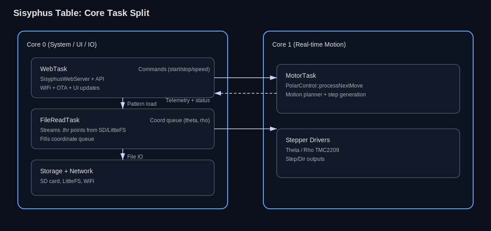
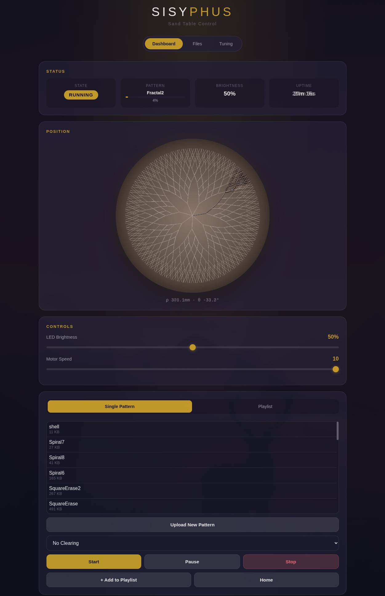

# Sisyphus Table Controller

ESP32 firmware for a Sisyphus-style polar-coordinate sand table. It drives Theta/Rho steppers, streams pattern files from SD, serves a Web UI/API, supports OTA updates, and provides motion tuning and diagnostics.

## Features
- Dual-core task split: real-time motion on Core 1, UI/network/file streaming on Core 0.
- S-curve motion planning with synchronized Theta/Rho timing and lookahead step generation.
- Web UI with live position visualization, playlist control, and tuning controls.
- SD card pattern storage, uploads, and optional PNG previews.
- OTA firmware updates and runtime telemetry.

## Architecture
At a high level the firmware is organized around three FreeRTOS tasks pinned across the two ESP32 cores. `src/main.cpp` creates a MotorTask on Core 1 for deterministic step generation, and a WebTask on Core 0 for the Web UI/API, WiFi, and OTA handling. `lib/PolarControl` owns the motion planner, driver configuration, and the inter-task queues. It also spins up a FileReadTask on Core 0 to stream `.thr` pattern points from SD/LittleFS into a coordinate queue. The MotorTask drains that queue and drives the stepper outputs, while the WebTask sends commands (start/stop/speed/tuning) and exposes telemetry back to the UI via SSE and JSON APIs.



## Hardware
- ESP32 dev board
- 2x (or 3x) TMC2209 stepper drivers (UART)
- 2x stepper motors (Theta + Rho)
- SD card module
- 12V/24V PSU sized for motors and LEDs

## Quick Start
1. Open the project in PlatformIO.
2. Adjust WiFi credentials in `lib/Config/src/Config.h` if desired.
3. Build and flash:
   ```bash
   pio run -t upload
   ```
4. Upload filesystem assets if needed:
   ```bash
   pio run -t uploadfs
   ```
5. Connect to the device IP and open the Web UI.

## Configuration
Key settings in `lib/Config/src/Config.h`:
- WiFi AP fallback credentials
- Static IP defaults (`100.76.149.200`)
- OTA hostname/password
- Task core affinity, stack sizes, and telemetry intervals

Pin defaults live in `lib/Config/src/Config.h`:
- Rho Step: 33
- Rho Dir: 25
- Theta Step: 32
- Theta Dir: 22
- UART RX: 27
- UART TX: 26
- Driver UART addresses: 0/1/2

## Web UI and API


Core endpoints (see `lib/WebServer/src/SisyphusWebServer.cpp`):
- `GET /` UI
- `GET /api/status` current state and telemetry
- `GET /api/stream` SSE position stream
- `POST /api/pattern/start` start a pattern
- `POST /api/pattern/stop|pause|resume` control playback
- `GET /api/files` list files
- `POST /api/files/upload` upload `.thr` and optional `.png`
- `POST /api/files/delete` delete a pattern
- `GET|POST /api/led/brightness` LED control
- `GET|POST /api/speed` speed control
- `GET /api/tuning/*` driver and motion tuning

## Pattern Format (.thr)
Text file of polar coordinates in radians and normalized radius:
```
# comments with # or //
0.0 0.5
0.1 0.5
...
6.28 0.5
```
- `theta`: radians
- `rho`: normalized 0.0 to 1.0 (scaled by max radius)
- Separators: space, comma, or tab

File parsing ignores empty/comment lines. Lines longer than 127 characters are skipped and reported to the error log.

## File Storage Layout
- Required: `/patterns/name/name.thr` and `/patterns/name/name.png`

The Web UI accepts `.thr` plus optional `.png` uploads with the same base name. This png should be an image of the path produced by the thr with a white line and transparent backgroud. This will be overlayed on the webpage over the position viewer.

## Motion Planning
- S-curve profiles per axis with synchronized segment durations.
- Lookahead step generation into a queue to avoid underruns.

## Logging and Diagnostics
- Serial logs include queue depth, underruns, timing stats, and state changes.
- Error log is stored in memory and exposed via `GET /api/errors`.

## Tests
Native motion planner tests:
```bash
pio run -e native
./run_all_tests.sh
